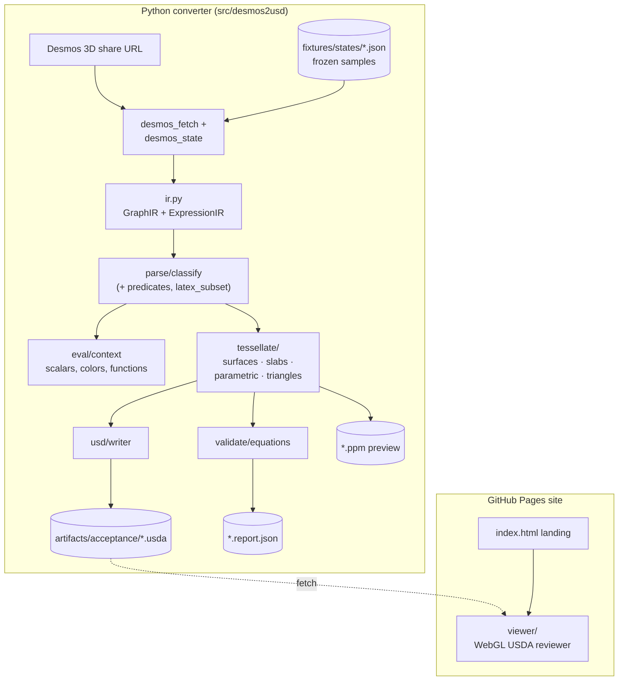

# desmos2usd

`desmos2usd` converts supported geometry from a public Desmos 3D share URL into an inspectable USDA file while preserving the original Desmos equations, restrictions, expression order, colors, and provenance as USD custom attributes. Unsupported expressions are reported explicitly with their id, kind, original LaTeX, and reason.

The implementation is deterministic and fixture-first. The required acceptance URLs are frozen under `fixtures/states/` so local and container verification do not depend on network access. Live fetching is implemented for normal use and can refresh fixtures when DNS/network access is available.

## Relationship to Desmos

This project is not affiliated with, endorsed by, or sponsored by Desmos. It works with public Desmos 3D share URLs for research and tooling purposes.

## Architecture



The pipeline is deterministic: the same fixture or freshly fetched state always produces the same USDA bytes. Every stage preserves source provenance — the LaTeX, restrictions, resolved color, and Desmos expression id are written back into the USDA as `desmos:*` custom attributes so the exported mesh can be traced back to its source expression.

## Key files

```text
desmos2usd/
├── src/desmos2usd/
│   ├── cli.py                 # CLI entry: `desmos2usd <url> -o out.usda`
│   ├── converter.py           # Top-level pipeline glue (URL → classified → geometry → USDA)
│   ├── desmos_fetch.py        # Fetch Desmos calculator state JSON (with fallbacks)
│   ├── desmos_state.py        # Load frozen fixture or live-fetched state
│   ├── desmos_url.py          # Parse/normalise public share URLs
│   ├── ir.py                  # `ExpressionIR`, `GraphIR`, `SourceInfo`
│   ├── eval/
│   │   ├── context.py         # `EvalContext` — scalars, lists, vectors, colors, functions
│   │   └── numeric.py         # Numeric evaluation helpers for the LaTeX AST
│   ├── parse/
│   │   ├── latex_subset.py    # LaTeX → Python AST subset
│   │   ├── predicates.py      # Comparison predicates + half-open strict evaluation
│   │   └── classify.py        # Register definitions, resolve `colorLatex`, classify kinds
│   ├── tessellate/
│   │   ├── mesh.py            # `GeometryData` dataclass + quad-face helpers
│   │   ├── surfaces.py        # Explicit surfaces (`z = f(x,y)` etc.) with bound inference
│   │   ├── slabs.py           # Inequality regions: bands, boxes, flat 2D regions
│   │   ├── parametric.py      # Parametric 3D curves
│   │   └── triangles.py       # Desmos `triangle(...)` meshes
│   ├── usd/
│   │   ├── writer.py          # Emit `.usda` with mesh + `desmos:*` custom attributes
│   │   └── metadata.py        # Prim naming + source-provenance metadata
│   └── validate/
│       ├── equations.py                 # Numeric check of emitted geometry vs source
│       ├── sample_suite.py              # Batch runner over the 5 acceptance URLs
│       ├── visual.py                    # Deterministic orthographic PPM preview
│       ├── prim_diagnostics.py          # Post-export geometric diagnostics
│       └── window_border_diagnostics.py # Shared-boundary / seam diagnostics
├── fixtures/states/*.json      # Frozen Desmos states for the 5 acceptance samples
├── artifacts/acceptance/       # Demo outputs: *.usda, *.report.json, *.ppm, summary.json
├── viewer/
│   ├── index.html              # USDA Review viewer shell
│   ├── app.js                  # WebGL USDA parser + renderer
│   └── styles.css
├── index.html                  # GitHub Pages landing page
├── tests/                      # `unittest` suite
├── pyproject.toml              # Project metadata (stdlib-only; MIT license)
└── LICENSE                     # MIT
```

## Install

```bash
python3 -m pip install -e .
```

The project intentionally uses only the Python standard library for conversion and validation.

## Export

```bash
python3 -m desmos2usd.cli https://www.desmos.com/3d/zaqxhna15w -o artifacts/zaqxhna15w.usda
```

By default, required sample URLs are read from frozen fixtures. Add `--refresh` to fetch from Desmos instead of the fixture cache:

```bash
python3 -m desmos2usd.cli https://www.desmos.com/3d/zaqxhna15w -o artifacts/live.usda --refresh
```

## Acceptance Suite

```bash
python3 -m desmos2usd.validate.sample_suite --out artifacts/acceptance
```

The suite exports all five required sample URLs, validates generated geometry against the parsed equations and restrictions, writes per-sample JSON reports, and creates a deterministic orthographic preview PPM for visual spot checks. Reports include both `valid` and `complete`: `valid` means every exported prim passed equation/restriction validation; `complete` means no classified renderable expressions were left unsupported.

## USDA Review Viewer

The static viewer in `viewer/` loads the generated USDA subset directly in the browser, including mesh points, `faceVertexCounts`, `faceVertexIndices`, Desmos colors, and custom metadata. It includes acceptance sample shortcuts, local file upload, drag-drop, orbit controls, and a prim metadata panel.

Serve it from the repo root:

```bash
python3 -m http.server <port>
```

Open `http://localhost:<port>/viewer/`. To review from an iPhone over tailnet, bind the server to all interfaces and open the tailnet host URL:

```bash
python3 -m http.server <port> --bind 0.0.0.0
```

See `viewer/README.md` for controls.

## Tests

```bash
python3 -m unittest discover -s tests
```

## Supported Desmos Subset

The converter currently handles these expression families from the frozen acceptance set and the planned initial Desmos subset:

- scalar constants such as `a=0.25`
- hidden helper constants used by visible expressions
- constant scalar lists such as `a=[-12,-10.8,...]` and list-broadcasted bounds such as `a < x < b`
- tuple constants such as `p_0=(0,0,0)`
- explicit surfaces and walls such as `z=f(x,y)`, `x=f(y,z)`, `y=f(x,z)`
- clipped explicit surfaces with inferred one-axis domains from the active restrictions
- chained inequalities and restrictions such as `-4 <= x <= 4`
- bands such as `f(x,y) <= z <= g(x,y)`
- bounded extrusions of 2D implicit regions and affine/function bands
- parametric 3D curves such as `(0,0,0)+t*(1,1,1) {0<=t<=1}`
- Desmos `triangle(...)` expressions with either three point arguments or a point plus two vector lists
- standard arithmetic, powers, square roots, trig functions, logarithms, and user-defined scalar functions

## Current Real-Fixture Coverage

All visible renderable expressions in the five frozen fixture states are parsed and classified. At resolution 8, the exporter writes validated prims for these counts and records the rest as unsupported:

- `zaqxhna15w`: 268 exported, 0 unsupported
- `ghnr7txz47`: 617 exported, 0 unsupported
- `yuqwjsfvsc`: 341 exported, 0 unsupported
- `vyp9ogyimt`: 553 exported, 5 unsupported contradictory-source inequality regions
- `k0fbxxwkqf`: 174 exported, 0 unsupported

Unsupported geometry is not silently skipped: it is present in the conversion report and acceptance JSON. The remaining unsupported real-fixture cases are confined to five source-side contradictory inequality regions in `vyp9ogyimt`; acceptance reporting records the empty constant intervals so these are separated from residual converter limitations.
